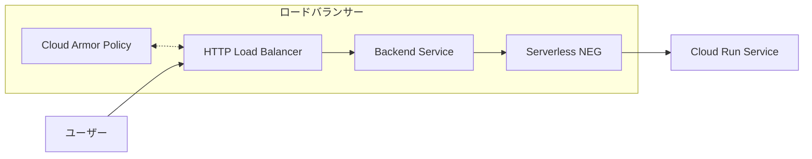
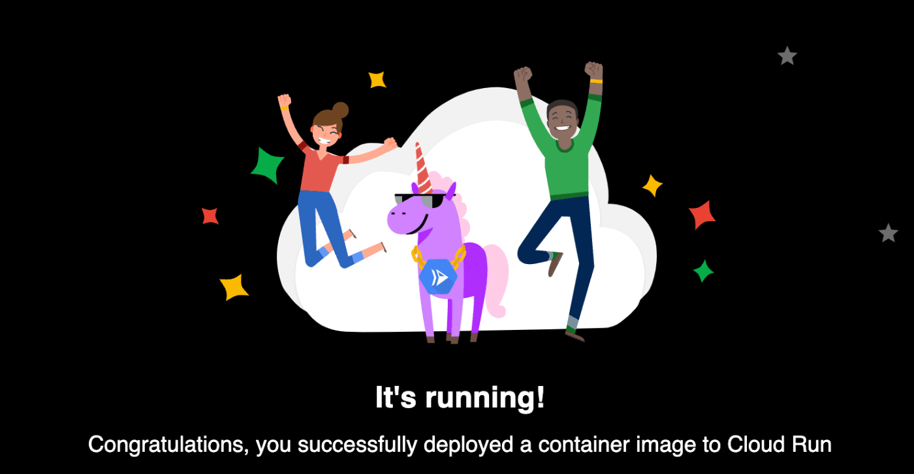

# 概要

Terraform を使用して Google Cloud Run にサンプルコンテナの hello アプリケーションをデプロイするリポジトリ

zenn記事: https://zenn.dev/sousquared/articles/dcdeeeaefea6e1  
参考: https://zenn.dev/hosimesi/articles/36fedaa5425c7b

# 構成図


# terraform 実行

```shell
$ make setup
$ make plan
$ make apply
```

# アクセス

作成されたIPにアクセスします。
```shell
$ make output

load_balancer_ip = {IP_ADDRESS}
```

http://{IP_ADDRESS} にアクセス

以下の画面が出てきたら成功です！


# クリーンアップ

Terraformで作成したリソースをすべて削除して、環境をクリーンな状態に戻すには、以下のコマンドを実行します。

```shell
$ make destroy
```
